# Plan de IA y agente especializado — Tutelas v1

Documento de decisiones técnicas cerradas para implementación. Complementa `VISION_TUTELAS.md` y `ROADMAP_TUTELAS.md`.

**Estado:** aprobado para planificación — pendiente de implementación.

---

## 1. Decisión: salir de Ollama en producción

### Problema con Ollama local

| Aspecto | Ollama + Qwen 2.5 14B | API cloud |
|---------|----------------------|-----------|
| Latencia extracción | 30–120 s por tutela | 2–8 s |
| Latencia chat (turno) | 15–60 s | 1–4 s |
| Contexto largo | Limitado por RAM; truncado en código actual | 128K–1M tokens |
| JSON estructurado | Aceptable con retries | Nativo (schema strict) |
| Costo | $0 + electricidad + hardware | ~$0.10–0.30 por tutela completa |

**Conclusión:** Ollama queda como **fallback offline / desarrollo sin internet**. Producción usa **API cloud con routing por tarea**.

---

## 2. Arquitectura de IA recomendada: router por tarea

No un solo modelo para todo. Cada paso del flujo tiene requisitos distintos:

```mermaid
flowchart TD
    subgraph extraccion [Extracción PDF]
        A[PDF parseado] --> B[Heurísticas regex]
        B --> C[Gemini 2.5 Flash]
        C --> D[JSON validado + confianza]
    end

    subgraph chat [Chat decisión]
        E[Contexto tutela + RAG biblioteca] --> F[Claude Sonnet 4]
        F --> G[Respuesta con fuentes]
    end

    subgraph word [Generación Word]
        H[Veredicto + plantilla fresca] --> I[Claude Sonnet 4]
        I --> J[JSON redacción jurídica]
        J --> K[docxtemplater]
    end

    subgraph fallback [Fallback]
        L[API no disponible] --> M[Ollama local]
    end
```



### Asignación de modelos (recomendación principal)

| Tarea | Modelo | Por qué |
|-------|--------|---------|
| **Extracción estructurada** | **Gemini 2.5 Flash** | 1M tokens de contexto (tutelas largas sin truncar), ~250–400 ms TTFT, multimodal para PDF escaneado, más barato en volumen |
| **Chat de decisión legal** | **Claude Sonnet 4** | Mejor análisis jurídico denso, menor alucinación, mejor seguimiento de instrucciones complejas |
| **Redacción considerandos/resuelve** | **Claude Sonnet 4** | Mismo modelo; calidad de prosa jurídica superior |
| **Reintento campo faltante** | **GPT-4o-mini** | JSON schema strict mode (99%+ conformidad); barato para calls cortos |
| **Desarrollo / offline** | **Ollama Qwen 2.5** | Sin costo API; lento pero funcional |

### Alternativa si prefieres un solo proveedor (simplicidad)

| Proveedor único | Configuración |
|-----------------|---------------|
| **Google (Gemini)** | Flash para extracción + chat + redacción. Pierdes ~5–8% precisión jurídica vs Claude en chat, ganas simplicidad y costo |
| **OpenAI** | GPT-4o-mini extracción + GPT-4o chat/redacción. Buen balance JSON + calidad |
| **Anthropic** | Haiku extracción + Sonnet chat. Más caro en extracción de alto volumen |

**Recomendación final:** router **Gemini Flash (extracción) + Claude Sonnet (chat/redacción)**. Es el mejor balance velocidad/costo/calidad jurídica para tutelas colombianas.

---

## 3. Estimación de costo por tutela

Supuestos: tutela de 40 páginas (~80K tokens input), 5 turnos de chat, 1 generación Word.

| Paso | Tokens aprox. | Costo estimado |
|------|---------------|----------------|
| Extracción (Gemini Flash) | 80K in + 2K out | ~$0.01 |
| Chat 5 turnos (Claude Sonnet) | 30K in + 5K out | ~$0.15 |
| Redacción Word (Claude Sonnet) | 15K in + 3K out | ~$0.08 |
| Reintentos / overhead | — | ~$0.02 |
| **Total por tutela** | | **~$0.25–0.35 USD** |

A ~100 tutelas/mes → **$25–35 USD/mes**. Aceptable para un despacho.

---

## 4. Agente especializado: qué es y cómo lo construimos

### 4.1 Agente de la app (runtime) ≠ Cursor Agent Skills

Son dos cosas distintas:

| | Agente runtime (tu producto) | Cursor Agent Skills |
|--|------------------------------|---------------------|
| **Dónde vive** | Backend Next.js + API | `.cursor/skills/` en el repo |
| **Quién lo usa** | Abogado en `/tutelas/nueva` | Cursor al **desarrollar** el código |
| **Cuándo corre** | Cada tutela en producción | Cuando programamos features |
| **Propósito** | Extraer, decidir, redactar tutelas | Guiar implementación correcta |

**Cursor Skills nos ayudan a construir bien el producto.** El agente runtime lo implementamos con prompts + RAG + router de modelos en código.

### 4.2 Arquitectura del agente runtime

```
┌─────────────────────────────────────────────────────────┐
│                    TutelaAgentService                    │
├─────────────────────────────────────────────────────────┤
│  System prompt base (rol, guardrails, disclaimer)       │
│  + Contexto tutela (formulario confirmado)              │
│  + RAG biblioteca (top-K chunks normativos)             │
│  + Historial chat (tutela_messages)                     │
│  + Skill modules (prompts especializados por fase)      │
└─────────────────────────────────────────────────────────┘
         │                    │                    │
         ▼                    ▼                    ▼
   extract()            chat()              generateDoc()
   Gemini Flash         Claude Sonnet       Claude Sonnet
```

### 4.3 "Skill modules" en runtime (patrón inspirado en Agent Skills)

En código, cada fase tiene un módulo de prompt equivalente a un SKILL.md:

| Módulo | Archivo propuesto | Contenido |
|--------|-------------------|-----------|
| Extracción tutela | `prompts/tutela-extract.md` | Schema JSON, reglas Decreto 2591, ejemplos |
| Análisis inicial | `prompts/tutela-analyze.md` | Estructura del primer mensaje del chat |
| Conversación | `prompts/tutela-chat.md` | Guardrails, citar solo biblioteca, no inventar |
| Redacción Word | `prompts/tutela-draft.md` | Formato considerandos/resuelve, tono judicial |

Estos archivos son versionables, editables sin tocar código, y el abogado podría ajustarlos en `/configuracion` en v2.

### 4.4 Cursor Agent Skills para desarrollo (repo)

Crearemos skills en `.cursor/skills/` para que Cursor implemente features alineadas:

| Skill | Propósito |
|-------|-----------|
| `tutela-domain` | Reglas de negocio tutela colombiana al escribir código |
| `tutela-extraction` | Convenciones del pipeline híbrido PDF → JSON |
| `tutela-docx` | docxtemplater, mammoth, no generar XML con LLM |

**Skills de GitHub/skills.sh:** no hay un pack maduro específico para tutelas colombianas en el registry público. Lo viable:

1. **Crear skills propias** en el repo (recomendado).
2. **Inspirarse en TutelaBot** (HuggingFace/GitHub) para contenido normativo en prompts, no como dependencia runtime.
3. **Evaluar MCP Normativa Colombia** (GitHub: `Normativa-colombiana-MCP`) como fuente **externa** de consulta normativa en v2 — complementa biblioteca local, no la reemplaza.

---

## 5. Plantilla Word al final del chat (decisión de producto)

### Problema que resuelve

Si la plantilla vive en biblioteca estática, puede quedar desactualizada cuando el juez cambia el formato. El abogado necesita usar **siempre el formato vigente**.

### Flujo acordado

```
Chat → consenso veredicto → "Generar borrador"
                              │
                              ▼
              ┌───────────────────────────────┐
              │  Subir archivo de referencia   │
              │  ○ Plantilla Word (.docx)      │
              │  ○ Tutela ya respondida (.docx)│
              └───────────────┬───────────────┘
                              │
                              ▼
              Análisis inmediato (mammoth + LLM)
              • Detectar secciones: encabezado,
                antecedentes, considerandos, resuelve
              • Mapear placeholders docxtemplater
                              │
                              ▼
              Generar borrador DOCX
              (NO se guarda en biblioteca global)
```

### Reglas

| Regla | Detalle |
|-------|---------|
| **Cuándo se sube** | Solo al generar borrador, post-consenso |
| **Dónde se guarda** | Adjunto de la tutela (`tutela_template_files`), no biblioteca |
| **Reutilización** | Opcional: "Usar plantilla de tutela anterior" si el abogado la subió antes en otra tutela del mismo despacho |
| **Análisis** | On-the-fly: mammoth → texto/estructura → LLM identifica secciones → docxtemplater |
| **Biblioteca** | Solo normas (Decreto 2591, Constitución, etc.), **nunca** plantillas de respuesta |

### UI propuesta (paso final)

```
┌─────────────────────────────────────────────────────┐
│  Generar borrador de respuesta                       │
│                                                      │
│  Veredicto confirmado: ADMITIR                       │
│                                                      │
│  Sube el formato que usará el despacho:              │
│  [ Arrastrar .docx aquí ]                            │
│                                                      │
│  ○ Plantilla oficial con placeholders                │
│  ○ Tutela resuelta de referencia (mismo veredicto)   │
│                                                      │
│  [ Analizar formato ]  [ Generar borrador ]          │
└─────────────────────────────────────────────────────┘
```

---

## 6. Variables de entorno (cloud)

Ver `.env.example` actualizado. Resumen:

```env
LEGAL_LLM_PROVIDER=router          # router | ollama | gemini | anthropic | openai

# Extracción
LEGAL_LLM_EXTRACT_PROVIDER=gemini
LEGAL_LLM_EXTRACT_MODEL=gemini-3.6-flash

# Chat + redacción
LEGAL_LLM_CHAT_PROVIDER=anthropic
LEGAL_LLM_CHAT_MODEL=claude-sonnet-4-20250514

# Fallback
LEGAL_LLM_FALLBACK_PROVIDER=ollama

# API keys
GEMINI_API_KEY=
ANTHROPIC_API_KEY=
OPENAI_API_KEY=          # opcional, reintentos JSON
```

---

## 7. Privacidad y datos sensibles

Las tutelas contienen datos personales. Antes de producción:

| Medida | Estado |
|--------|--------|
| No loguear contenido completo de tutelas | Pendiente |
| API keys solo en servidor | Ya así |
| Opción "modo local" con Ollama para casos sensibles | Mantener fallback |
| Acuerdo con proveedor API (retención de datos) | Revisar ToS Google/Anthropic |
| Anonimización en entorno de pruebas | Responsabilidad del abogado |

**Nota:** Gemini y Anthropic API tienen políticas de no entrenar con datos API en planes estándar. Verificar términos vigentes al contratar.

---

## 8. Decisiones cerradas (checklist Fase 0)

- [x] Formato pre-formulario aprobado
- [x] Plantilla Word al final del chat (no en biblioteca)
- [x] Proveedor IA: router Gemini Flash + Claude Sonnet
- [x] Ollama solo fallback/desarrollo
- [x] Agent Skills: crear propias en repo para desarrollo
- [x] Runtime agent: prompt modules + RAG biblioteca
- [ ] API keys configuradas (tu tarea)
- [ ] 5 tutelas anonimizadas para pruebas (tu tarea)
- [ ] 1 plantilla Word ejemplo (tu tarea)

---

## 9. Próximo paso

Con este plan cerrado, la implementación arranca en **Fase 1** del roadmap:

1. Rutas `/tutelas/nueva` con 2 pestañas
2. Abstracción `LlmRouter` (Gemini + Anthropic + Ollama fallback)
3. Skills de desarrollo en `.cursor/skills/tutela-domain/`

Ver `ROADMAP_TUTELAS.md` actualizado.
